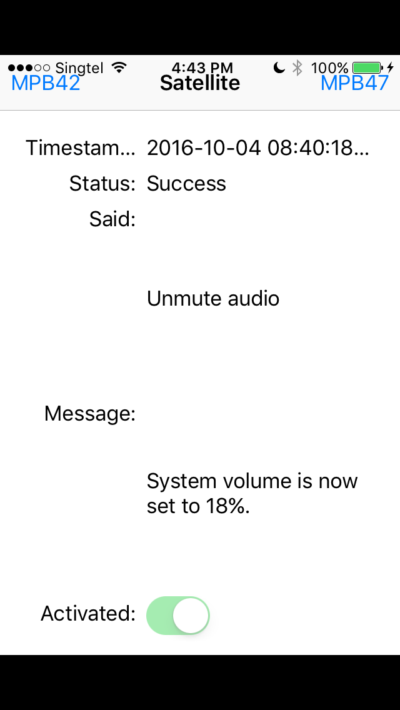

# Computer Satellite

An iOS app to control a Mac running [Computer Command][1]. Although it's just an experiment that's no longer maintained, it's been updated to work on iOS 10.

## 

## Background

Computer Satellite was written back in 2012 as a primitive voice-controlled system. Once paired with [Computer Command][1], it still works, albeit a little slowly. Plus, it uses those beautiful Star Trek LCARS computer beeps and that makes me very happy.

Most of the code from back then has been preserved, but a few changes were made in 2016 to allow Xcode 8 to build it for iOS 10.

## Usage

Simply open the Xcode project, connect an iOS device, and build and run.

Once the app is launched, wait about 3 seconds while it calibrates the background volume. Then activate it by saying "Computer"; this works like "Hey Siri" or "OK Google". It may be slow. Once you hear the double beep, speak your command clearly.

Set up [Computer Command][1]. Without setting that up, the only commands it can respond to are "What is the time" and "What is the date". Anything else will crash the app.

## How it works

1. Pocketsphinx (through OpenEars) listens to voice commands.
2. Once the activation keyword "Computer" is heard, the app is "activated" until 5 seconds after the last utterance.
3. When some text is recognized, Satellite checks if it's "WHAT IS THE TIME" or "WHAT IS THE DATE". If it is, it responds immediately using the NSDate APIs. If not, it attempts to send a HTTP POST request to Computer Command with the recognized text.
4. [Computer Command][1] tells Computer Satellite what beeps to use and what to say.

Essentially, Computer Satellite transcribes voice and tells Computer Command about it. At this point, I hadn't managed to figure out an easy way to do text-to-speech on OS X; OpenEars was only available on iOS.

## Known issues

1. OpenEars starts listening when the synthesizer is still speaking, and then the app starts responding to itself.

[1]: https://github.com/taneliang/Computer-Command
